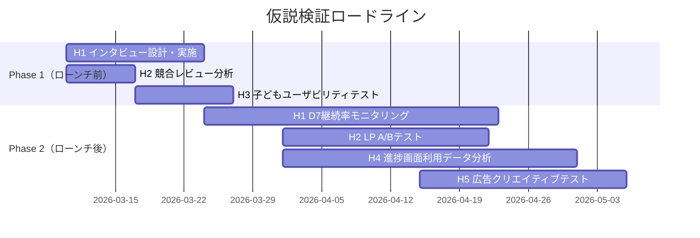
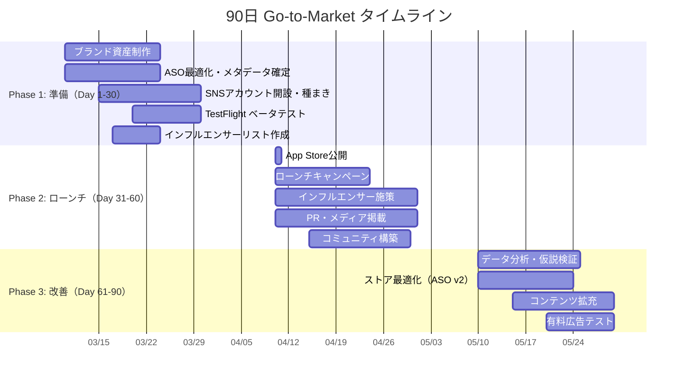

# Pic-tan マーケティング戦略 & Go-to-Market プラン

> **作成日**: 2026-03-04  
> **ステータス**: ドラフト v1.0（レビュー待ち）  
> **対象**: プロジェクトオーナー / 意思決定者

---

## 目次

1. [コンセプト確定案（3案 + 推奨）](#1-コンセプト確定案)
2. [親向け価値仮説の検証設計](#2-親向け価値仮説の検証設計)
3. [マネタイズ設計](#3-マネタイズ設計)
4. [App Store 向けメッセージング](#4-app-store-向けメッセージング)
5. [90日 Go-to-Market プラン](#5-90日-go-to-market-プラン)
6. [最初の7日間アクションプラン](#6-最初の7日間アクションプラン)

---

## 1. コンセプト確定案

### 案A:「おやこ習慣」路線 — 毎日の親子ルーティンアプリ

| 項目 | 内容 |
|------|------|
| **コンセプト名** | 「1日3分、かわいいで始まるおやこ習慣」 |
| **ターゲット** | 共働き家庭の親（30-40代）、子ども4-6歳（未就学） |
| **提供価値** | 歯磨き・お着替えと並ぶ「1日のルーティン」として言語接触を組み込む。学習のハードルを最小化し、親子の「いっしょにやる時間」を提供する |
| **差別化** | 「学習」ではなく「習慣」と定義。競合が「成果」を訴求する中、Pic-tanは「毎日開く」ことだけを約束する。他アプリは1セッション10-15分が標準→3分の徹底した短時間設計 |
| **弱点** | 「たった3分で何が身につくの？」という効果疑問への答えが弱い。教育効果を求める親には訴求力が足りない可能性 |

### 案B:「安心ファースト」路線 — 子ども安全の英語はじめてアプリ

| 項目 | 内容 |
|------|------|
| **コンセプト名** | 「広告なし、安心設計。はじめての英語はここから」 |
| **ターゲット** | 安全性を最重視する親（未就学〜小1）、特にスマホを子どもに渡すことに不安を持つ層 |
| **提供価値** | 広告なし・外部リンクなし・個人情報最小を前面に打ち出し、「安心してスマホを渡せる」体験を提供。子どもの初めてのアプリ体験として安全である |
| **差別化** | 子ども向けアプリ市場の最大の不満「広告・課金誘導」を完全排除。COPPA/GDPR-K準拠の設計をブランド価値として前面に出す |
| **弱点** | 「安心」は差別化要因になるが、購入動機としては弱い（安心だから買う、とはなりにくい）。機能面の訴求が薄くなり、「何ができるアプリなのか」が伝わりにくい |

### 案C:「かわいい入口」路線 — ビジュアル体験で言葉に出会うアプリ

| 項目 | 内容 |
|------|------|
| **コンセプト名** | 「かわいいカードで、ことばに出会おう」 |
| **ターゲット** | 子どもの「好き」を入口にしたい親（4-7歳）、特に従来の学習アプリに子どもが飽きた経験のある層 |
| **提供価値** | フェルトドール風のかわいいビジュアルが入口。「勉強」ではなく「かわいい絵を見る」体験から自然に日英語彙に触れる。子ども自身が「開きたい」と思うアプリ |
| **差別化** | 独自のフェルトドール風アートスタイル。競合の多くはフラットイラストやゲーム風→Pic-tanは温かみのあるビジュアルで唯一のポジション。子どもの「開きたい」動機を最重視 |
| **弱点** | ビジュアルの好みは主観的。アートスタイルが刺さらない層には響かない。教育的訴求が弱く「おもちゃアプリ」と見られるリスク |

---

### ✅ 推奨案: **案A「おやこ習慣」路線**（案B・Cの要素を統合）

#### 推奨理由

```
推奨コンセプト（統合版）:
「1日3分、かわいいで始まる親子ことば習慣。広告なし、安心設計。」
```

| 判断軸 | 案A（習慣） | 案B（安心） | 案C（かわいい） | 判定 |
|--------|:-----------:|:-----------:|:---------------:|:----:|
| **親の購入動機の強さ** | ◎ 日常に組み込める実用性 | △ 安心だけでは弱い | ○ 子どもが使いたがる | A |
| **継続利用の訴求力** | ◎ 習慣化がコア | ○ 安心で継続 | △ 飽きリスク | A |
| **子どもの能動的利用** | ○ ルーティン化 | △ 子ども視点薄い | ◎ 自発的に開く | C |
| **親の口コミ発生力** | ◎ 「毎日やってる」が語りやすい | ○ 安心は共感されやすい | ○ ビジュアル映え | A |
| **競合との差別化** | ◎ 3分習慣は独自 | ○ ad-freeは増加中 | ◎ アート路線は独自 | A=C |
| **App Storeでの伝わりやすさ** | ◎ 明確なベネフィット | ○ 機能が見えにくい | ○ 体験が伝わりにくい | A |

**論理的根拠:**

1. **購入動機の階層構造**: 親の意思決定は「①子どもにとって有害でないか（安心）→ ②続けられるか（習慣）→ ③効果があるか（学習）」の順に検討される。案Aは②をコアに①を内包でき、③を過度に約束しない点でブランド方針とも整合する

2. **口コミの再現性**: 「うちの子が毎朝3分やってる」は具体的で再現可能な口コミ。「安心です」「かわいいです」より情報量が多く、他の親の購入判断材料になりやすい

3. **ASO（App Store Optimization）との親和性**: 「3分」「毎日」「習慣」は検索キーワードとしても機能し、メタデータに自然に組み込める

4. **案B・Cの要素は統合可能**: 安心設計は案Aのサブメッセージとして機能する。かわいいビジュアルはUI/UXレイヤーで実現され、コンセプト言語に頼らなくても伝わる

> [!IMPORTANT]
> **確定コンセプト（推奨）**: 「1日3分、かわいいで始まる親子ことば習慣」を主軸に、安心設計をサブメッセージとして運用する。ビジュアルの魅力はスクリーンショットとプレビュー動画で訴求し、言語コピーには頼らない。

---

## 2. 親向け価値仮説の検証設計

### 仮説一覧と検証マトリクス

| # | 仮説 | 検証方法 | 成功指標 | 優先度 |
|---|------|----------|----------|--------|
| H1 | **「3分なら毎日続けられる」と親は感じる** | ① ユーザーインタビュー（N=8-12）<br>② MVP利用テスト（7日間） | 定性: 8割以上が「3分は現実的」と回答<br>定量: D7継続率 ≥ 40% | 🔴 最優先 |
| H2 | **「広告なし」は購入判断の上位理由になる** | ① App Storeレビュー競合分析<br>② LP A/Bテスト（広告なし訴求 vs 学習効果訴求） | 定性: 競合レビューで広告不満が上位3位以内<br>定量: LP CVR差 ≥ 15% | 🟡 高 |
| H3 | **かわいいビジュアルが子どもの「開きたい」動機になる** | ① 対面ユーザビリティテスト（子ども N=5-8）<br>② ストアスクリーンショットA/Bテスト | 定性: 子どもが自発的にアプリを選ぶ割合 ≥ 60%<br>定量: ストアCVR差 ≥ 10% | 🟡 高 |
| H4 | **「やった内容が見える」と親の満足度が上がる** | ① MVP内の進捗画面あり/なしテスト<br>② インタビューでの反応確認 | 定性: 進捗確認した親の満足度が有意に高い<br>定量: 進捗画面閲覧率 ≥ 50%/週 | 🟢 中 |
| H5 | **親は「英語学習」より「親子の時間」に価値を感じる** | ① 広告クリエイティブテスト（Instagram/X）<br>② インタビュー深掘り | 定性: 「一緒にやる」言及が「英語力」より多い<br>定量: 「親子時間」訴求広告のCTR ≥ 「英語学習」訴求の1.2倍 | 🟢 中 |

### 検証の実施順序



### 各仮説の検証詳細

#### H1:「3分なら毎日続けられる」

**インタビュー設計:**
- 対象: 4-8歳の子どもを持つ親 8-12名（共働き4名、片働き4名、ひとり親2名）
- 形式: 30分オンラインインタビュー
- 核心質問:
  - 「お子さんのスクリーンタイムは1日どのくらいですか？」
  - 「3分だけのアプリ、毎日続けられそうですか？いつやりますか？」
  - 「今使っている学習アプリで、続かなかった経験はありますか？その理由は？」
- 判定ライン: 8名中6名以上が「3分は現実的」と回答 → **仮説支持**

**MVPテスト:**
- TestFlight配布 → 7日間の利用データ取得
- D1継続率 ≥ 60%, D7継続率 ≥ 40% → **仮説支持**

#### H2:「広告なしは購入判断の上位理由」

**競合レビュー分析:**
- 対象アプリ: 子ども向け英語学習アプリ上位10本（日本App Store）
- 分析ポイント: ★1-2レビューの不満カテゴリ分類
- 判定ライン: 「広告」関連不満が全体の20%以上 → **仮説支持**

**LP A/Bテスト（ローンチ後）:**
- パターンA: 「広告なし・安心設計」をヒーローコピーに
- パターンB: 「3分で英語に触れる」をヒーローコピーに
- 流入: Instagram広告 各200クリック以上
- 判定ライン: CVR差 ≥ 15% → **勝ちパターンを採用**

#### H3:「かわいいビジュアル = 子どもの起動動機」

**対面テスト:**
- 対象: 4-7歳の子ども 5-8名
- 手法: iPadに3つのアプリアイコンを並べ、「どれを開きたい？」と聞く
- 比較対象: Pic-tan / 競合A（フラットイラスト系）/ 競合B（ゲーム系）
- 判定ライン: Pic-tanを選ぶ子ども ≥ 60% → **仮説支持**

#### H4:「進捗の可視化 = 親満足度向上」

**実装テスト（ローンチ後）:**
- 進捗ダッシュボードの閲覧率を計測
- 週1回以上閲覧する親の割合 ≥ 50% → **仮説支持**
- 閲覧した親 vs しない親の継続率比較

#### H5:「親子の時間 > 英語学習」

**広告クリエイティブテスト:**
- クリエイティブA: 「親子で一緒に3分、ことばの時間」（親子訴求）
- クリエイティブB: 「3分で英単語15語に触れる」（学習訴求）
- Instagram/X広告 各5,000インプレッション
- 判定ライン: CTR差 ≥ 20% → **勝ちメッセージを主軸に**

---

## 3. マネタイズ設計

### モデル比較

| 評価軸 | 買い切り | サブスクリプション | フリーミアム（無料+アンロック） |
|--------|:--------:|:-----------------:|:-----------------------------:|
| **初期売上の立ちやすさ** | ◎ 理解しやすい | △ 継続が前提 | ○ 試用で転換 |
| **LTV最大化** | △ 1回限り | ◎ 継続課金 | ○ 転換率次第 |
| **親の心理的ハードル** | ○ 明朗会計 | △「解約忘れ」不信 | ◎ 無料で試せる |
| **子ども向けアプリとの相性** | ◎ シンプル | △ 子どもが解約操作不可 | ◎ 試してから判断 |
| **MVP段階での実装コスト** | ◎ 最小 | △ 決済管理が複雑 | ○ 制限ロジック必要 |
| **App Store審査リスク** | ◎ 低い | ○ 自動更新規約順守要 | ◎ 低い |
| **口コミ発生しやすさ** | ○ 購入者のみ | △ 試用なし | ◎ 無料ユーザーも拡散 |

### ✅ 推奨: **フリーミアム（無料MVP + 1回買い切りで全解放）**

#### 推奨理由

1. **試用ハードルゼロ**: 親は無料でダウンロード→子どもに試させる→納得して課金。子ども向けアプリで最も自然な購買フロー
2. **口コミの母数最大化**: 無料ユーザーも利用体験を持つため、SNSや対面での推薦が発生しやすい
3. **サブスク不信の回避**: 子ども向けアプリの「解約し忘れ」問題は親の大きな不満。1回買い切りは「安心設計」のブランドメッセージと一貫する
4. **実装の段階的な拡張性**: 初期は1回買い切り→将来的にコンテンツパック課金やサブスクへの進化が可能

#### 価格設計

| 項目 | 設定 |
|------|------|
| **無料版の範囲** | 1テーマ（どうぶつ）15語 / 全学習モード利用可 / 7日間制限なし |
| **無料→有料の転換トリガー** | 7日目以降に「新しいテーマがまもなく届くよ！」通知 + テーマ追加の案内 |
| **有料版の価格（推奨）** | **¥480〜¥800**（USD $3.99〜$5.99） |
| **価格レンジの根拠** | 子ども向け学習アプリの中央値が¥600前後。Pic-tanはMVPコンテンツ量を考慮し¥480でスタートし、コンテンツ追加に合わせて¥800へ段階的に引き上げ |
| **初期ローンチ価格** | **¥480**（ローンチ記念価格として訴求） |

#### フリーミアム設計の具体的制限

```
┌─────────────────────────────────────────┐
│  無料版（ずっと無料）                      │
│  ・どうぶつテーマ 15語                     │
│  ・全学習モード（EN→JA, JA→EN, 絵→EN/JA） │
│  ・マスコットリアクション                   │
│  ・進捗の基本表示                          │
├─────────────────────────────────────────┤
│  有料版（1回 ¥480 で永久アンロック）        │
│  ・全テーマアンロック（追加テーマ含む）      │
│  ・詳細な進捗ダッシュボード                 │
│  ・テーマリクエスト・優先追加               │
│  ・将来の新テーマも自動追加                 │
└─────────────────────────────────────────┘
```

> [!TIP]
> **初期戦略**: 無料版だけでも十分に使えるように設計する。「課金しないと使い物にならない」感は絶対に避ける。無料版で満足→口コミ発生→有料版は「もっとやりたい」需要に応える構造。

#### 将来的なマネタイズ拡張パス

| 時期 | 施策 | 説明 |
|------|------|------|
| Phase 1（ローンチ） | 1回買い切り ¥480 | 全テーマアンロック |
| Phase 2（6ヶ月後） | テーマパック追加課金 ¥120-240/パック | たべもの、のりもの等 |
| Phase 3（12ヶ月後） | 年間サブスク検討 | 月額¥300 or 年額¥2,400 で全コンテンツ+新テーマ優先 |

---

## 4. App Store 向けメッセージング

### タイトル案（30文字以内）

| # | タイトル | キーワード狙い | 推奨 |
|---|---------|---------------|:----:|
| 1 | **Pic-tan ピクたん - こども英語** | 英語、こども | |
| 2 | **Pic-tan - えいごカードで毎日3分** | えいご、カード、3分 | ⭐ |
| 3 | **ピクたん：かわいい英語カード** | かわいい、英語、カード | |
| 4 | **Pic-tan - はじめてのえいご習慣** | はじめて、えいご、習慣 | |
| 5 | **ピクたん - おやこ英語3分レッスン** | おやこ、英語、3分 | |

> **推奨: #2** — 「えいごカード」で学習形式が明確 +「毎日3分」で習慣コンセプトが伝わる + ASO的にも「えいご」「カード」「3分」の3キーワードを自然に包含

### サブタイトル案（30文字以内）

| # | サブタイトル | 訴求ポイント |推奨 |
|---|------------|------------|:----:|
| 1 | かわいい絵で覚える日英ことば | ビジュアル + バイリンガル | |
| 2 | 広告なし・親子で安心ことば習慣 | 安心 + 習慣 | ⭐ |
| 3 | こどもが自分から開く英語アプリ | 子どもの能動性 | |
| 4 | 1日3分、えいごとにほんごカード | 時間 + バイリンガル | |
| 5 | フェルトどうぶつで英語デビュー | ビジュアル + はじめて | |

> **推奨: #2** — タイトルで「えいごカード・3分」を訴求→サブタイトルで「広告なし・安心」を補完。2つ合わせて主要訴求ポイントを網羅

### 30秒で伝わるストア説明（短文・プロモーションテキスト）

```
🐾 かわいいフェルトどうぶつカードで、えいごとにほんごに毎日触れよう。

1日たった3分。広告なし・安心設計だから、おこさまに安心して渡せます。
むずかしいドリルではありません。「かわいい！」から始まる、親子のことば習慣アプリです。

✅ 広告なし、完全安心設計
✅ 1回3分、毎日続けやすい
✅ えいご⇔にほんご ワンタップ切替
✅ 4歳からはじめられるシンプル操作
```

### 長文説明（親が安心できる構成）

```
━━━━━━━━━━━━━━━━━━━━━━━━━━━━

Pic-tan（ピクたん）は、かわいいフェルトどうぶつの
カードで、えいごとにほんごに毎日触れる習慣アプリです。

━━━━━━━━━━━━━━━━━━━━━━━━━━━━

🌟 こんなご家庭にぴったりです

・こどもに英語に触れさせたいけど、何から始めれば…
・学習アプリを試したけど、すぐ飽きてしまった
・広告が出るアプリは安心して渡せない
・毎日の習慣にできる、短くてかんたんなアプリを探している

━━━━━━━━━━━━━━━━━━━━━━━━━━━━

🎨 Pic-tanの特長

【かわいいから、毎日開きたい】
フェルトドール風のあたたかいイラストで描かれた
どうぶつカード。こどもが「見たい！」と自分から
開きたくなるデザインです。

【1日たった3分】
1セッションは約3分。朝ごはんの前、おやすみ前、
おでかけの待ち時間に。おうちのリズムに自然に
組み込めます。

【えいご⇔にほんご、ワンタップ切替】
画面をワンタップで英語と日本語を切り替え。
パパ・ママの英語力に関係なく、おこさまと
いっしょに楽しめます。

【4段階のかんたん評価】
「かんぺき」「まあまあ」「むずかしい」
「わからない」の4つだけ。おこさまが自分で
ポンとタップするだけで、自然な復習サイクルが
生まれます。

━━━━━━━━━━━━━━━━━━━━━━━━━━━━

🔒 保護者のみなさまへ — 安心への取り組み

✅ 広告は一切ありません
✅ 外部サイトへの誘導はありません
✅ おこさまの個人情報は収集しません
✅ アプリ内から直接購入する導線はありません
✅ 対象年齢 4歳以上

Pic-tanは「こどもが安心して使える」ことを
最優先に設計しています。

━━━━━━━━━━━━━━━━━━━━━━━━━━━━

📊 おこさまの「がんばり」が見える

・今日学んだことば
・得意なことば、苦手なことば
・連続学習日数

おこさまの成長を、そっと見守れます。

━━━━━━━━━━━━━━━━━━━━━━━━━━━━

💡 Pic-tanが大切にしていること

Pic-tanは「英語がペラペラになる魔法のアプリ」
ではありません。

毎日3分、かわいいカードを通じて、えいごと
にほんごの「ことば」にふれる習慣をつくる。
それがPic-tanの約束です。

無理に覚えさせるのではなく、毎日ことばに
出会う体験を積み重ねる。小さな積み重ねが、
おこさまの「ことばの世界」を広げていきます。

━━━━━━━━━━━━━━━━━━━━━━━━━━━━

📱 無料ではじめられます

「どうぶつ」テーマ（15語）は無料でお使い
いただけます。気に入っていただけたら、
ワンタイム購入で全テーマをアンロックできます。
サブスクリプション（定期課金）ではありません。

━━━━━━━━━━━━━━━━━━━━━━━━━━━━

🐾 1日3分、かわいいで始まる親子ことば習慣。
   今日からPic-tanで始めてみませんか？

━━━━━━━━━━━━━━━━━━━━━━━━━━━━
```

### キーワード候補（ASO用・100文字以内）

```
英語,えいご,こども,子供,幼児,4歳,知育,カード,フラッシュカード,単語,習慣,親子,広告なし,安心,学習,日本語,にほんご,バイリンガル,かわいい,どうぶつ
```

---

## 5. 90日 Go-to-Market プラン

### フェーズ概要



---

### Phase 1: 準備（Day 1-30）

**目標**: ローンチ日に最大インパクトを出すための土台を整える

| Week | 施策 | 担当領域 | 成果物 |
|------|------|----------|--------|
| **W1** | ブランドガイドライン確定（色・フォント・トーン） | デザイン | ブランドガイドPDF |
| **W1** | App Storeメタデータ最終化 | マーケ | タイトル/サブタイトル/説明文/キーワード |
| **W1** | SNSアカウント開設（Instagram, X） | マーケ | アカウント + プロフィール設定 |
| **W2** | スクリーンショット5枚制作 | デザイン | ストア用画像 |
| **W2** | プレビュー動画（15-30秒）制作 | デザイン | App Storeプレビュー |
| **W2** | プレスキット制作 | マーケ | ロゴ・スクショ・概要文のパッケージ |
| **W3** | TestFlight配布開始（ベータテスター20-30名） | 開発 | TestFlightリンク |
| **W3** | SNS種まきコンテンツ投稿開始（週3回） | マーケ | 投稿コンテンツ |
| **W3** | インフルエンサーリスト作成（育児系・教育系 20名） | マーケ | リスト + コンタクト計画 |
| **W4** | ベータフィードバック収集・反映 | 開発 | バグ修正 + 改善点リスト |
| **W4** | ローンチ日確定・プレスリリース準備 | マーケ | プレスリリース原稿 |
| **W4** | App Store審査提出 | 開発 | 審査承認 |

**SNS種まきコンテンツ例:**
- 「開発中のアプリ、ちょっとだけお見せします 🐾」（ティーザー）
- 「フェルトどうぶつ、何匹いるでしょう？」（インタラクティブ）
- 「1日3分、こどもの英語習慣ってどう思いますか？」（問いかけ）
- 開発過程のビハインドシーン

---

### Phase 2: ローンチ（Day 31-60）

**目標**: 初動1,000ダウンロード＆レビュー50件獲得

| Week | 施策 | チャネル | KPI |
|------|------|----------|-----|
| **W5** | ローンチ日投稿（全SNS同時） | Instagram, X | インプレッション 10,000+ |
| **W5** | Product Huntなどへの掲載 | コミュニティ | Upvote 50+ |
| **W5** | ベータテスターにレビュー依頼 | App Store | レビュー 20件 |
| **W6** | インフルエンサーにプロモコード配布 | Instagram, YouTube | フォロワーリーチ 50,000+ |
| **W6** | 育児系メディアへプレスリリース送付 | PR | 掲載 3媒体以上 |
| **W6** | 「ローンチ記念¥480」キャンペーン告知 | 全チャネル | 有料転換率 5%+ |
| **W7** | 親コミュニティでの紹介（知育系FB/LINEグループ） | コミュニティ | DL 200+/週 |
| **W7** | ユーザーレビューへの全件返信開始 | App Store | 返信率 100% |
| **W8** | ローンチ2週間データレビュー | 分析 | レポート作成 |

**インフルエンサー戦略:**

| 区分 | フォロワー規模 | 人数 | 報酬 | 期待効果 |
|------|---------------|------|------|----------|
| ナノ | 1,000-5,000 | 10名 | プロモコード + ¥0 | 信頼性の高い口コミ |
| マイクロ | 5,000-30,000 | 5名 | プロモコード + ギフト¥3,000 | 認知拡大 + 信頼 |
| ミッド | 30,000-100,000 | 2名 | プロモコード + 報酬¥10,000-30,000 | 大量認知 |

**コミュニティ投稿テンプレート:**
```
【ご紹介】こども向け英語習慣アプリ「Pic-tan」

4歳の娘が毎朝「ピクたんやる！」と自分で開くようになりました🐾

✅ 1日3分だけ
✅ 広告なし
✅ かわいいフェルトどうぶつ
✅ 英語⇔日本語ワンタップ切替

無料で15語お試しできます。
[App Storeリンク]
```

---

### Phase 3: 改善（Day 61-90）

**目標**: データに基づく改善サイクル確立 & 有料チャネルのテスト開始

| Week | 施策 | 詳細 | KPI |
|------|------|------|-----|
| **W9** | リテンション分析 | D1/D7/D30を分析、離脱ポイント特定 | D7 ≥ 40% |
| **W9** | ASO v2最適化 | 検索キーワードデータに基づくタイトル/キーワード調整 | ストアインプレッション +20% |
| **W10** | コンテンツ第2弾（たべものテーマ）準備 | 「新テーマ追加」をニュース化 | 復帰率 +15% |
| **W10** | App内レビュー依頼の最適化 | タイミング/頻度の調整 | レビュー依頼→投稿率 15%+ |
| **W11** | Instagram広告テスト（少額: ¥10,000-30,000） | 2-3クリエイティブ × 2ターゲット | CPI ≤ ¥200 |
| **W11** | Apple Search Ads テスト | ブランドキーワード + カテゴリキーワード | CPI ≤ ¥150 |
| **W12** | 90日レビュー & Phase 2計画策定 | 全KPIの振り返り | レポート + 次期計画 |

---

### 週次KPIダッシュボード

| カテゴリ | 指標 | 目標値（ローンチ後30日） | 測定ツール |
|----------|------|:-----------------------:|------------|
| **獲得** | 週間DL数 | 200+/週 | App Store Connect |
| **獲得** | ストアページCVR | ≥ 30% | App Store Connect |
| **獲得** | CPI（有料広告時） | ≤ ¥200 | 広告管理画面 |
| **継続** | D1継続率 | ≥ 60% | Firebase/Amplitude |
| **継続** | D7継続率 | ≥ 40% | Firebase/Amplitude |
| **継続** | D30継続率 | ≥ 20% | Firebase/Amplitude |
| **課金** | 無料→有料転換率 | ≥ 5% | App Store Connect |
| **課金** | ARPU（全ユーザー平均単価） | ≥ ¥24/月 | App Store Connect |
| **評判** | App Store評価 | ≥ 4.5 | App Store Connect |
| **評判** | レビュー件数 | 50件/月 | App Store Connect |
| **評判** | レビュー返信率 | 100% | 手動 |
| **SNS** | フォロワー増加 | +100/週 | Instagram/X |
| **SNS** | エンゲージメント率 | ≥ 3% | Instagram/X |

---

## 6. 最初の7日間アクションプラン

> [!IMPORTANT]
> **前提**: このアクションプランは「マーケティング準備」に焦点を当てています。開発タスク（PT-011等）は並行して進行する想定です。

### Day 1（3/5 水）— 基盤固め

| 時間帯 | タスク | 成果物 | 所要時間 |
|--------|--------|--------|:--------:|
| AM | ✅ 本戦略ドキュメントの最終レビュー・承認 | 承認済み戦略書 | 30分 |
| AM | 競合アプリ10本のリストアップ（名前・価格・評価・DL数概算） | 競合リスト.xlsx | 1時間 |
| PM | 競合アプリの★1-2レビュー分析（H2検証の一部） | レビュー分析メモ | 1.5時間 |
| PM | Instagram & X アカウント開設 | アカウントURL | 30分 |

### Day 2（3/6 木）— ブランド＆ASO

| 時間帯 | タスク | 成果物 | 所要時間 |
|--------|--------|--------|:--------:|
| AM | App Storeタイトル・サブタイトル最終決定 | 確定コピー | 30分 |
| AM | ASOキーワード100文字の最終選定 | キーワードリスト | 1時間 |
| PM | App Store長文説明の日本語最終版作成 | 説明文テキスト | 1時間 |
| PM | App Store長文説明の英語版作成 | 英語説明文テキスト | 1時間 |

### Day 3（3/7 金）— ビジュアル資産

| 時間帯 | タスク | 成果物 | 所要時間 |
|--------|--------|--------|:--------:|
| AM | スクリーンショット5枚の構成・コピー決定 | ワイヤーフレーム | 1時間 |
| PM | スクリーンショット制作（アプリ画面+テキストオーバーレイ） | スクショ5枚（6.7" & 6.1"） | 2時間 |
| PM | アプリアイコンの最終確認 | 1024×1024 アイコン | 30分 |

### Day 4（3/8 土）— コンテンツ準備

| 時間帯 | タスク | 成果物 | 所要時間 |
|--------|--------|--------|:--------:|
| AM | SNS投稿カレンダー（2週間分）作成 | 投稿カレンダー | 1時間 |
| AM | ローンチ前ティーザー投稿3本の原稿作成 | 投稿テキスト+画像案 | 1時間 |
| PM | プレスキット作成（ロゴ・スクショ・概要・コンタクト） | プレスキットZIP | 1時間 |

### Day 5（3/9 日）— ペルソナ＆検証準備

| 時間帯 | タスク | 成果物 | 所要時間 |
|--------|--------|--------|:--------:|
| AM | インタビュー対象者のリクルート計画作成 | リクルート計画書 | 45分 |
| AM | インタビューガイド（H1, H5用）のドラフト | ガイド文書 | 1時間 |
| PM | 休息日（無理しない） | — | — |

### Day 6（3/10 月）— チャネル開拓

| 時間帯 | タスク | 成果物 | 所要時間 |
|--------|--------|--------|:--------:|
| AM | 育児系インフルエンサー20名リストアップ | インフルエンサーリスト | 1.5時間 |
| AM | インフルエンサー連絡テンプレート作成 | DM/メールテンプレート | 30分 |
| PM | 育児系コミュニティ10個のリストアップ | コミュニティリスト | 1時間 |
| PM | SNS最初の投稿（ティーザー #1）を公開 | 公開済み投稿 | 30分 |

### Day 7（3/11 火）— レビュー＆計画

| 時間帯 | タスク | 成果物 | 所要時間 |
|--------|--------|--------|:--------:|
| AM | Week 1の進捗レビュー | 進捗チェックリスト | 30分 |
| AM | Week 2-4の詳細計画策定 | 週次計画書 | 1時間 |
| PM | TestFlightベータテスターリスト作成（20-30名） | テスターリスト | 45分 |
| PM | Apple Developer Program申込み手続き | 申込み完了 | 30分 |

---

## 優先度マトリクス

### 🔴 今すぐやること（Day 1-7）

1. 本戦略の承認
2. 競合レビュー分析（H2検証の初期データ）
3. App Store メタデータ確定
4. SNSアカウント開設
5. Apple Developer Program 申込み

### 🟡 ローンチ前にやること（Day 8-30）

1. スクリーンショット・プレビュー動画制作
2. TestFlight ベータテスト実施
3. インフルエンサーへの事前コンタクト
4. プレスキット・プレスリリース準備
5. ユーザーインタビュー実施（H1, H5）

### 🟢 ローンチ後にやること（Day 31-90）

1. LP A/Bテスト（H2）
2. 有料広告テスト（Instagram, Apple Search Ads）
3. コンテンツ第2弾開発
4. ASO v2最適化
5. サブスクリプションモデルの検討開始

### ⚪ 後でやること（Day 91+）

1. 多言語展開（韓国語、中国語など）
2. Android版開発
3. 法人向けプラン検討
4. オフライン学習イベント連携

---

> [!NOTE]
> **このドキュメントの運用方法**: 本戦略書は「生きたドキュメント」として運用します。週次で KPI を確認し、仮説検証の結果に基づいて戦略を更新してください。特に Phase 2（ローンチ後）のデータに基づく意思決定が、Pic-tan の成長を左右します。

---

*Prepared for Pic-tan Project — Marketing Strategy v1.0*
